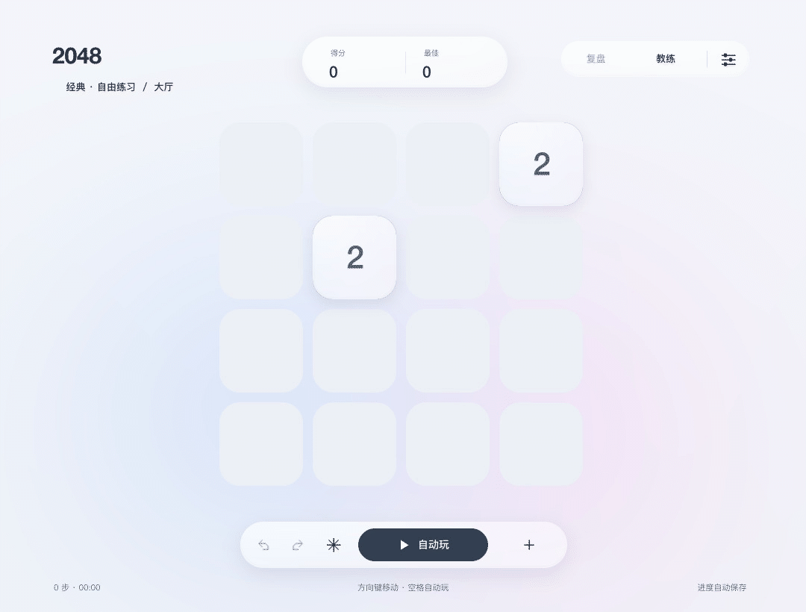

# LUMINA 2048

[简体中文](README.zh-CN.md) · [English](README.en.md) · [日本語](README.ja.md)

タイルを動かし、同じ数字を合体させて、2 から 2048、その先へ。じっくり遊ぶならクラシック、短い問題ならパズル。能力を選ぶ遠征や、負けた局面を立て直すレスキューも楽しめます。

**Web 版：[LUMINA 2048 を開く](https://lumina-2048.vercel.app/)**

Web 版は公開されています。アカウント登録やログインは不要で、リンクを開くと遊べます。URL を切り替える前に、旧サイトの設定で「导出进度」を選び、新サイトの「导入进度」で読み込んでください。セーブは新しい URL へ自動では移行されません。

**ダウンロード：[アプリ配布物・オフライン説明書](https://github.com/srwang0506/2048-Atelier/releases/latest)** · [ソースコード](https://github.com/srwang0506/2048-Atelier)

Windows は Releases の Windows x64 パッケージを選んでください。GitHub の「Download ZIP」はソースのみです。iPhone / iPad 版は現在、ビルド用の原生ソースを提供しており、署名済みインストーラーはありません。

## 使う端末を選ぶ

| 端末 | 始め方 | 説明 |
|---|---|---|
| **Mac** | ゲームフォルダーの **启动游戏.command** をダブルクリック。初回は導入ガイドに従って環境を準備します。 | [Mac の導入と対処](docs/ja/07-macos.md) |
| **Windows 10 / 11・x64** | ポータブル版を完全に展開して **2048.exe** を開きます。Python の別途導入は不要です。 | [Windows の導入と対処](docs/ja/08-windows.md) |
| **iPhone / iPad** | ネイティブ版は現在ソースでの提供です。Mac の Xcode でビルド・署名して導入します。インストール用 IPA やストア配信はありません。 | [iPhone / iPad の導入と操作](docs/ja/09-mobile.md) |
| **ブラウザー** | 独立したタッチ Web 版を、スワイプや方向ボタンで遊べます。 | [Web 版の説明](docs/ja/09-mobile.md) |

対応する版は Mac / Windows デスクトップ v12、iPhone / iPad ネイティブ 1.0.1、タッチ Web v1 です。ネイティブ版の対象は iOS / iPadOS 16.4 以上。ゲーム表示は現在主に中国語で、説明書は中国語・英語・日本語に対応しています。

Windows は exe だけでなく、展開したフォルダー全体を残してください。説明書専用 ZIP は文章と実演のみで、ゲームは起動できません。

## 最初の一局

1. 「经典」（クラシック）を選びます。PC はモード選択から、ネイティブの携帯版はクラシックから始まります。
2. 矢印／WASD、または盤面内のドラッグ・スワイプで、全タイルを一方向に動かします。
3. 同じ数字が合体します。2 + 2 = 4、4 + 4 = 8。その手でできたタイルは、同じ手では再合体しません。
4. 有効な移動後には通常、新しいタイルが出ます。動かない方向は手数を使わず、出現もありません。
5. 2048 の後も続けられます。満杯でも、合体できる組み合わせがあればまだ続行できます。

Mac デスクトップ版の実際の操作です。[GIF と動画のチュートリアル](docs/ja/10-gallery.md)でほかの遊び方も確認できます。

## 六つの遊び方

| モード | 内容 |
|---|---|
| **クラシック** | 手数無制限で盤面を整え、より大きな数字を目指します。 |
| **遠征** | 六ステージの手数制限。能力を選び、エネルギーで交換や凝時を使います。 |
| **レスキュー** | 敗局からの局面を六手以内に三マス以上の空きへ戻します。練習三問付き。 |
| **パズルシアター** | 十二問の固定パズル。指定手数で目標の数字を作り、三つ星を狙います。 |
| **デイリー** | 日付ごとの課題。同じ日付と操作順なら出現を再現できます。 |
| **60 手スプリント** | 有効な六十手で高得点を目指します。 |

進行はモードごとに保持します。得点・星・勝敗は[ゲームのルール](docs/ja/03-rules.md)、遠征の全能力は[能力ガイド](docs/ja/04-expedition.md)を参照してください。

## 自分で考える、AI に一手頼む

ヒントは次の方向を提案します。自動プレイは停止するか手動で動かすまで続けます。ヒントや AI は補助使用として記録の分類に反映され、取り消しでは解除されません。AI は端末内で動き、毎回決まった数字に到達する保証はありません。

PC の主なキー操作です。

| 操作 | キー |
|---|---|
| 移動 | 矢印／WASD |
| 取り消し／やり直し | Z／Shift+Z または Y |
| ヒント／AI の一手 | H／Enter |
| 自動プレイ／停止 | Space |
| モード選択／リプレイ | B／R |

全操作は[PC 操作ガイド](docs/ja/02-controls.md)へ。携帯・タブレットは画面のボタンを使います。PC のキー操作がそのままネイティブ App に使えるわけではありません。

## 保存と端末の変更

自動保存されます。ディスクを外す前に正常終了してください。Mac はゲーム内の `data/`、Windows は `%LOCALAPPDATA%\2048-Atelier\data` に保存します。ネイティブ版と Web 版は設定から JSON を書き出せます。

端末間の自動同期はありません。同じ v12 の Mac と Windows は移行できますが、ネイティブ・Web・デスクトップは別形式です。端末の変更や読み込みの前に[バックアップと移行](docs/ja/06-saves.md)を確認してください。

## 困ったときは

- [日本語の全ガイド](docs/ja/index.html) · [言語を選ぶ](docs/index.html)
- [よくある質問](docs/ja/12-support.md) · [iPhone / iPad の詳しい説明](docs/native/docs/ja/index.html)
- [パズルとレスキューの全解答](docs/ja/11-solutions.md)：ネタバレを含むので、まず自分で挑戦してみてください。

Windows が起動しない場合は `启动游戏.bat` でエラーを確認するか、`check-windows.bat` で診断します。[版と検証の説明](docs/ja/12-support.md)に対応範囲があります。Windows 実機、iPhone / iPad 端末での受け入れ確認は未完了です。
