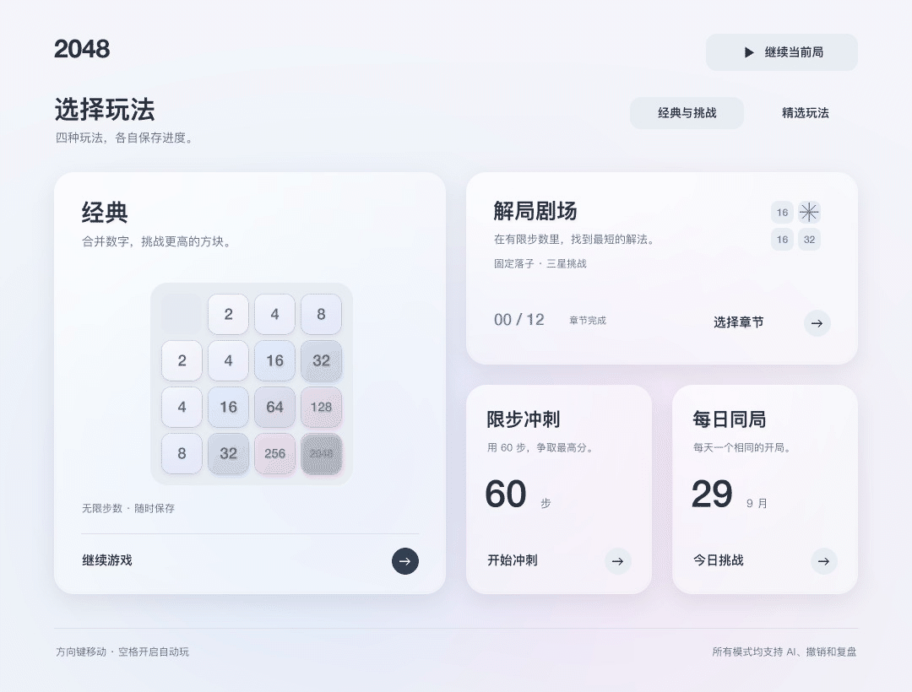
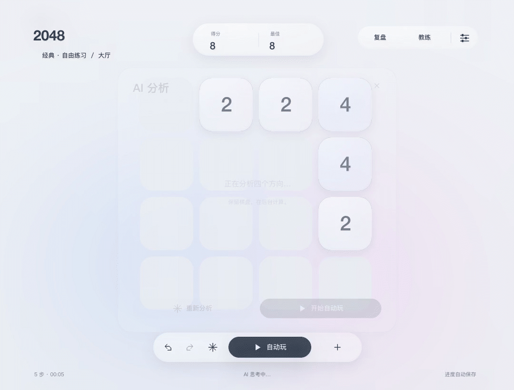
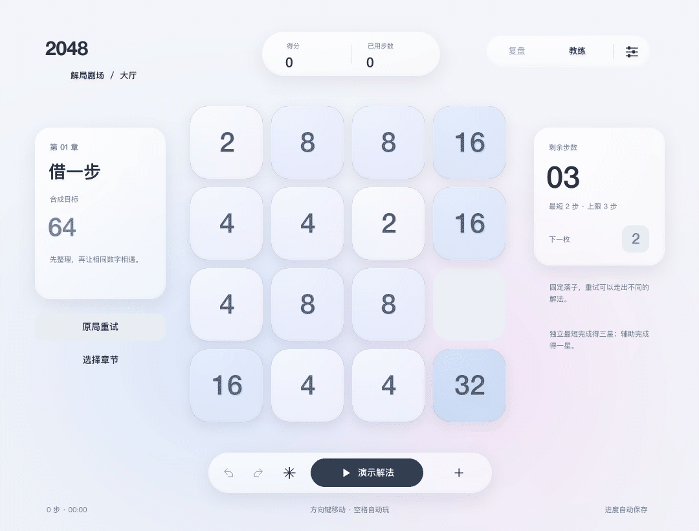
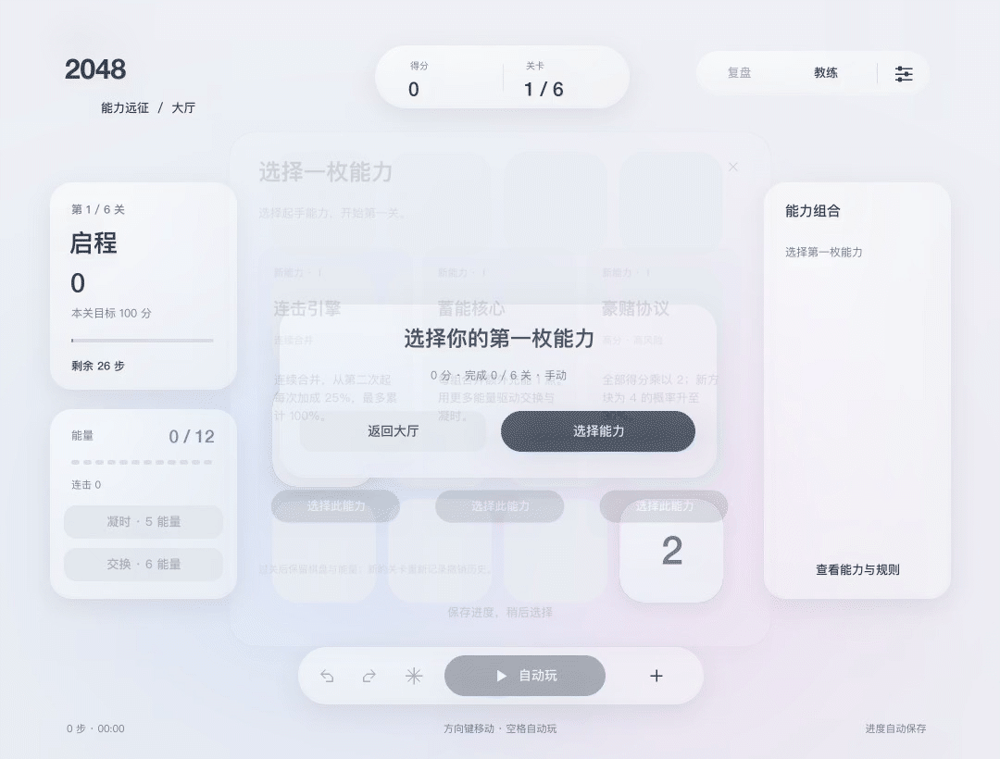
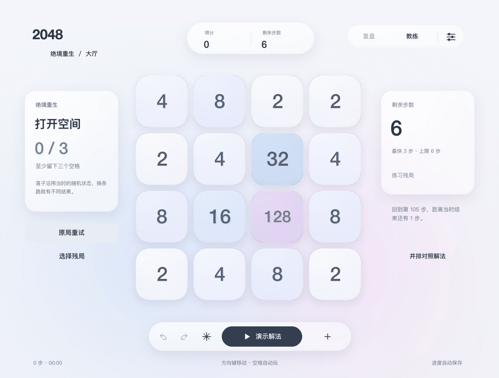
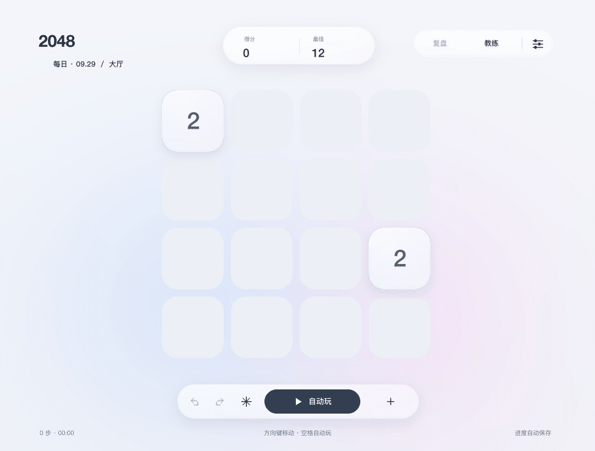
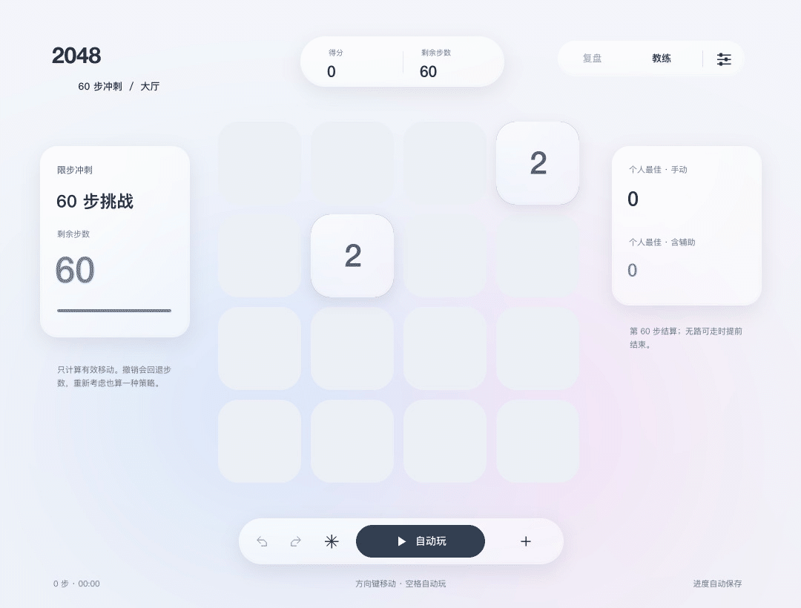

# 十七本のゲーム実演

デスクトップ八本と原生九本を収録。実際のコードで動かした画像から MP4 を作り、その配布 MP4 を復号して GIF にしています。12 fps の教材で、実画面の性能測定ではありません。HTML は停止状態から再生でき、MP4 も開けます。Markdown は通常自動で繰り返します。

## Mac / Windows デスクトップ v12 の操作

Mac の実際の Python / pygame 描画を SDL dummy と独立した一時セーブで記録しています。Windows と共通コードですが、Windows 実機の録画ではありません。無音で、個人セーブは使いません。

### ロビー：クラシックを先頭に

クラシックのページから精选玩法へ移り、戻って開始します。対局中は B でロビーへ戻れます。

[GIF](../media/10-desktop-lobby.gif) · [MP4 · 6.00 s](../media/10-desktop-lobby.mp4) · [PNG](../media/10-desktop-lobby-poster.png)

### クラシック：移動・取り消し・やり直し

seed 42 の実際の新局で左・下・左・上・右、その後に取り消しとやり直し。盤面・得点・手数が一緒に戻ります。

[GIF](../media/11-desktop-classic.gif) · [MP4 · 7.00 s](../media/11-desktop-classic.mp4) · [PNG](../media/11-desktop-classic-poster.png)

### AI 分析・一手・リプレイ

実際のワーカーで分析し、左の予測、一手実行、履歴表示を行います。リプレイでは現在の盤面を変えません。

[GIF](../media/12-desktop-ai-replay.gif) · [MP4 · 8.50 s](../media/12-desktop-ai-replay.mp4) · [PNG](../media/12-desktop-ai-replay-poster.png)

### パズル：二手で 64

第一章を初期状態から上・上と動かし、実際に三つ星で達成します。解答を含みます。

[GIF](../media/13-desktop-puzzle.gif) · [MP4 · 5.33 s](../media/13-desktop-puzzle.mp4) · [PNG](../media/13-desktop-puzzle-poster.png)

### 遠征：能力選択と充電

seed 13 の新局で蓄能核心を選び、移動とエネルギー、説明パネルを見ます。第一ステージの導入で、六ステージ全編ではありません。

[GIF](../media/14-desktop-expedition.gif) · [MP4 · 8.00 s](../media/14-desktop-expedition.mp4) · [PNG](../media/14-desktop-expedition-poster.png)

### レスキュー：三手と経路比較

練習一問目を右・上・上で三空きに戻し、成功後に比較を開いて進めます。解答を含みます。

[GIF](../media/15-desktop-rescue.gif) · [MP4 · 6.83 s](../media/15-desktop-rescue.mp4) · [PNG](../media/15-desktop-rescue-poster.png)

### デイリー：固定日付と履歴

正式な daily_game で 2026-09-29 を生成し、移動・取り消し・やり直しを示します。無効な方向は手数に入りません。

[GIF](../media/16-desktop-daily.gif) · [MP4 · 6.67 s](../media/16-desktop-daily.mp4) · [PNG](../media/16-desktop-daily-poster.png)

### スプリント：残り手数を見る

seed 42 の新局を五手進め、取り消しとやり直しを行います。手数の説明で、60 手目の終了映像ではありません。

[GIF](../media/17-desktop-sprint.gif) · [MP4 · 7.50 s](../media/17-desktop-sprint.mp4) · [PNG](../media/17-desktop-sprint-poster.png)

## iPhone / iPad 原生版の操作（Mac ホスト表示）

九本の GIF はネイティブコードを実行して採取した動画から変換し、元の MP4 も同梱しています。環境は macOS ネイティブプレビューで、**iPhone / iPad の録画や実機 FPS 検査ではありません**。下の英語帯は教材の注釈です。HTML では停止可能、Markdown では通常ループします。MP4 は H.264 形式です。HTML の動画プレイヤーを開くか、ダウンロードして再生できます。すべてローカルで、通信は不要です。

### クラシック：移動・合体・出現

seed 42 で実際に進めた中盤から再開。盤面全体の移動、同じ数字の合体、得点、新タイルを確認します。方向は下の帯に表示します。

最大タイルを角付近に保つ練習に。合体しない移動でも新タイルは出ます。

[GIF](../native/docs/media/01-classic.gif) · [MP4 · 6.08 s](../native/docs/media/01-classic.mp4) · [PNG](../native/docs/media/01-classic-poster.png)

### 戻す・やり直す：同じ出現を復元

一手動かし、戻して、やり直します。盤面、点数、手数が一緒に変わります。

やり直しは三点メニュー内です。乱数状態も復元するので引き直しではありません。

[GIF](../native/docs/media/02-undo-redo.gif) · [MP4 · 5.58 s](../native/docs/media/02-undo-redo.mp4) · [PNG](../native/docs/media/02-undo-redo-poster.png)

### AI：ヒント・実行・自動・停止

ヒントを要求して実行し、自動プレイを開始してから止めます。

下部表示が手動からアシストへ変化。止めてもアシスト区分は残ります。

[GIF](../native/docs/media/03-ai.gif) · [MP4 · 11.5 s](../native/docs/media/03-ai.mp4) · [PNG](../native/docs/media/03-ai-poster.png)

### 遠征：三択と序盤

seed 42 の新しい遠征で蓄電コアを選び、数手動かします。

複数組の合体でエネルギーが増えます。ステージ点と累計点の違いを確認します。

[GIF](../native/docs/media/04-expedition-draft.gif) · [MP4 · 7.25 s](../native/docs/media/04-expedition-draft.mp4) · [PNG](../native/docs/media/04-expedition-draft-poster.png)

### 遠征：凝時と交換

実際の操作で 12 エネルギーを得た状態から、凝時、異なる二枚の交換、二回の移動を実演します。

能力を使っても残り手数は変わらず、凝時中の移動では新タイルが出ません。

[GIF](../native/docs/media/05-expedition-powers.gif) · [MP4 · 6.42 s](../native/docs/media/05-expedition-powers.mp4) · [PNG](../native/docs/media/05-expedition-powers-poster.png)

### パズル：二手で 64

第 01 問を最初から、上、上と動かして 64 にします。

解答を含みます。ヒントと戻すを使わず、星三つを取得します。

[GIF](../native/docs/media/06-puzzle.gif) · [MP4 · 4.67 s](../native/docs/media/06-puzzle.mp4) · [PNG](../native/docs/media/06-puzzle-poster.png)

### レスキュー：失敗する手と救済ルート

練習「一线生机」で元の左移動による詰みを再現。最初からやり直して、右、上、上と進めます。

二つの結末を比較します。成功には出現後の空き三マスが必要。クラシック全局の録画ではなく、問題の実操作です。

[GIF](../native/docs/media/07-rescue.gif) · [MP4 · 7.58 s](../native/docs/media/07-rescue.mp4) · [PNG](../native/docs/media/07-rescue-poster.png)

### デイリー：同じ日付で再開始

例の日付 2026-09-29 で三手動かし、最初から始め直します。

最初の二枚が元に戻ることを確認します。通信による同期ではありません。

[GIF](../native/docs/media/08-daily.gif) · [MP4 · 5.83 s](../native/docs/media/08-daily.mp4) · [PNG](../native/docs/media/08-daily-poster.png)

### スプリント：最後の三手

seed 42 の本物の局を 57 手目まで進め、残り三手と終了を収録します。

残りが 3 から 0 へ減ります。秒数制限ではなく、第 61 手はありません。

[GIF](../native/docs/media/09-sprint.gif) · [MP4 · 5.58 s](../native/docs/media/09-sprint.mp4) · [PNG](../native/docs/media/09-sprint-poster.png)

[Media / 媒体 / メディア](../native/docs/media/README.md)
