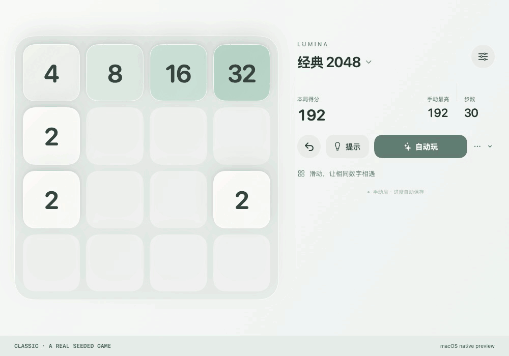
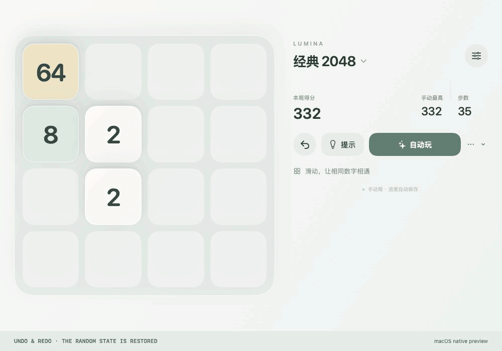
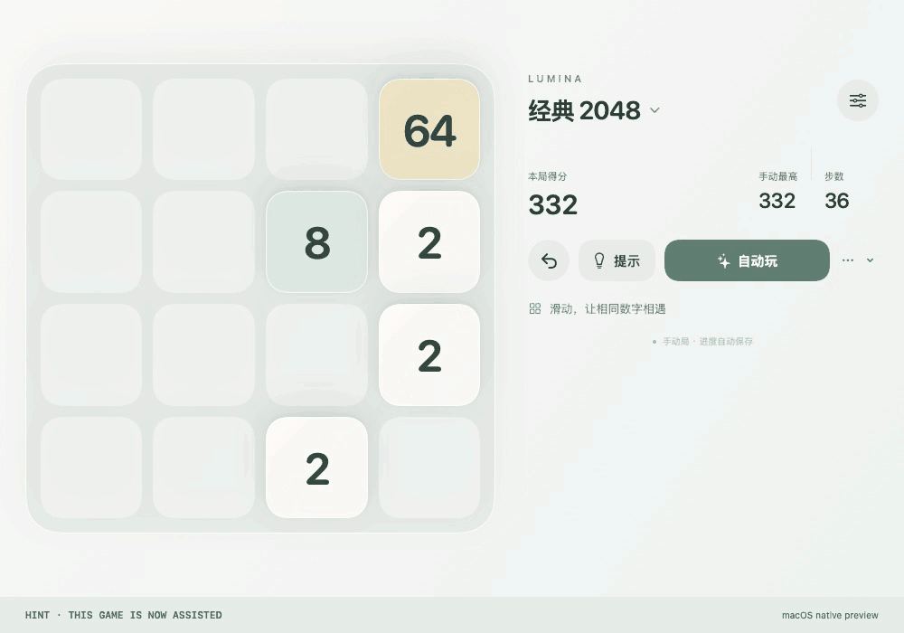
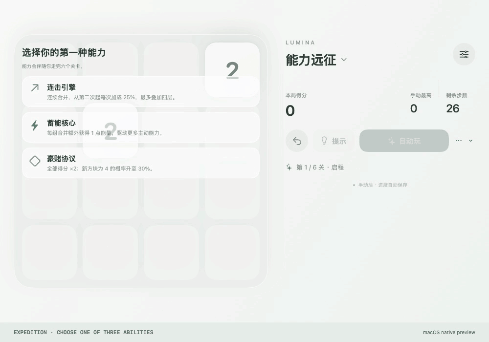
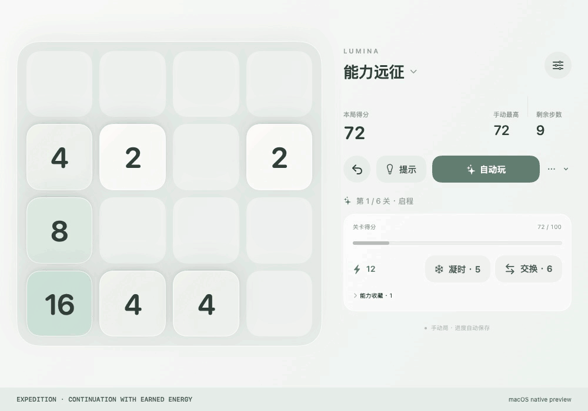
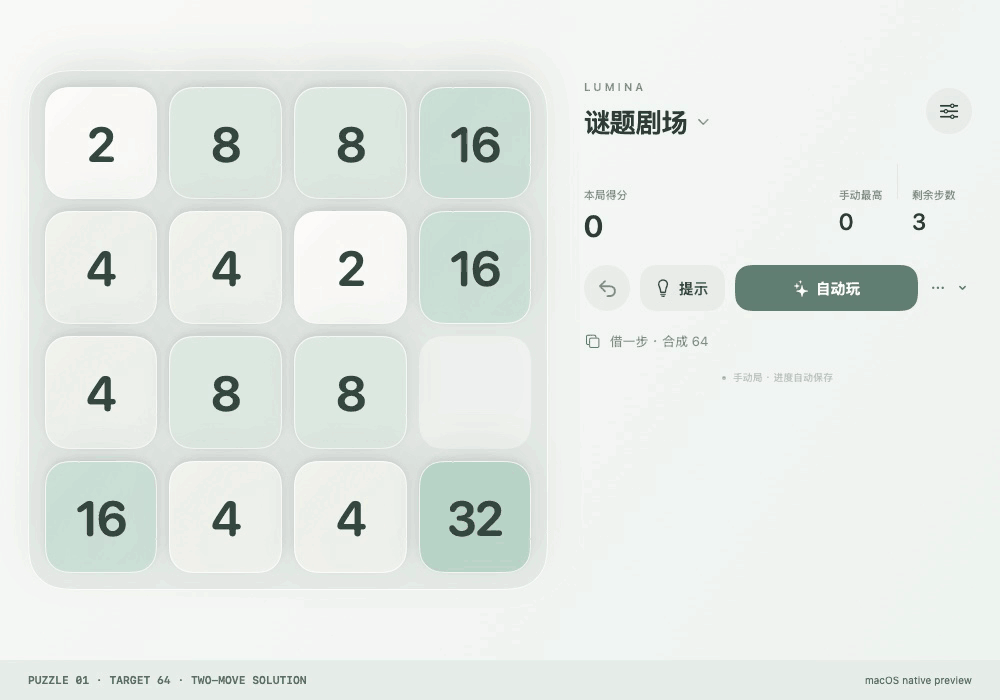
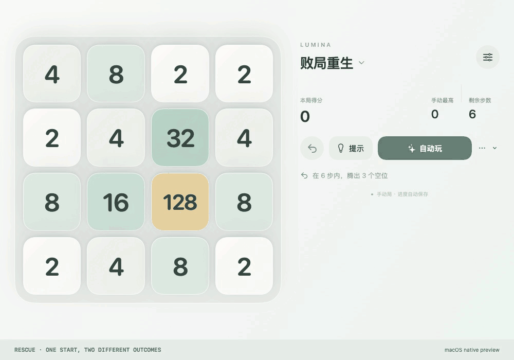
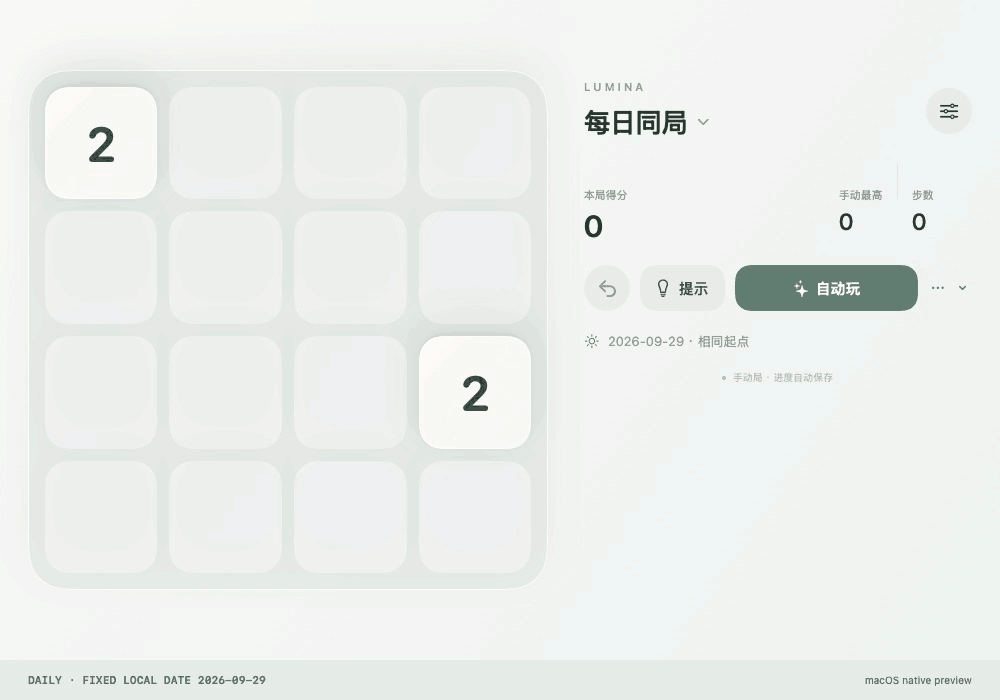
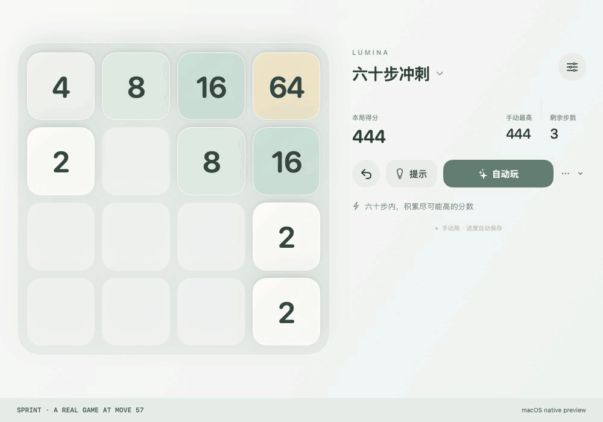

# Nine animated tutorials

These nine GIFs are converted from sampled videos of the actual native code running. The MP4 source videos are included. Capture platform: macOS native preview, **not iPhone / iPad screen recording or a device FPS test**. The English bottom strip is a tutorial annotation. The HTML reader can pause animations; Markdown viewers usually loop them. MP4 uses H.264. Expand the video player in the HTML reader or download it for separate playback. All media is local and works offline.

## Classic: slide, merge and spawn

Continue a real seed-42 game from midgame. Watch the entire board slide, equal values merge, the score rise and a new tile appear. The bottom strip identifies directions.

Try keeping your largest tile near a corner. A slide without a merge still spawns a tile.

[GIF](../media/01-classic.gif) · [MP4 · 6.08 s](../media/01-classic.mp4) · [PNG](../media/01-classic-poster.png)

## Undo and redo: restore the same spawn

Make one move, undo it, then redo. The board, score and counter change together.

Redo is in the ellipsis menu. The random state is restored too; this is not a reroll.

[GIF](../media/02-undo-redo.gif) · [MP4 · 5.58 s](../media/02-undo-redo.mp4) · [PNG](../media/02-undo-redo-poster.png)

## AI: hint, follow, autoplay and pause

Request a hint, follow it, run autoplay, then pause.

The footer changes from manual to assisted. Pausing does not clear the assisted flag.

[GIF](../media/03-ai.gif) · [MP4 · 11.5 s](../media/03-ai.mp4) · [PNG](../media/03-ai-poster.png)

## Expedition: draft and opening moves

Begin a seed-42 expedition, choose Battery Core and make several valid moves.

Multiple merged pairs earn more energy. Distinguish the stage target from cumulative score.

[GIF](../media/04-expedition-draft.gif) · [MP4 · 7.25 s](../media/04-expedition-draft.mp4) · [PNG](../media/04-expedition-draft-poster.png)

## Expedition: freeze and swap

Continue from an actually played position with 12 energy. Freeze, select two different values to swap, then make two moves.

Active powers leave the move counter unchanged. Frozen moves do not spawn a new tile.

[GIF](../media/05-expedition-powers.gif) · [MP4 · 6.42 s](../media/05-expedition-powers.mp4) · [PNG](../media/05-expedition-powers-poster.png)

## Puzzle: make 64 in two moves

Puzzle 01 from its reset state: up, then up, reaching 64.

Contains the solution. No hint or undo is used, so the result earns three stars.

[GIF](../media/06-puzzle.gif) · [MP4 · 4.67 s](../media/06-puzzle.mp4) · [PNG](../media/06-puzzle-poster.png)

## Rescue: a failed move and a recovery route

Practice A Glimmer of Hope: left reproduces the original blocked outcome. Restart, then right, up, up.

Compare the outcomes. Success requires at least three empty cells after spawning. This shows actual challenge actions, not a full Classic recording.

[GIF](../media/07-rescue.gif) · [MP4 · 7.58 s](../media/07-rescue.mp4) · [PNG](../media/07-rescue-poster.png)

## Daily: same date, same restart

Use the fixed demonstration date 2026-09-29, make three moves, then restart.

The two initial tiles match the opening. No network synchronization is involved.

[GIF](../media/08-daily.gif) · [MP4 · 5.83 s](../media/08-daily.mp4) · [PNG](../media/08-daily-poster.png)

## Sprint: final three moves

A real seed-42 Sprint is advanced to move 57, then the last three moves and result are captured.

Remaining moves fall from 3 to 0. This is not a timer, and there is no move 61.

[GIF](../media/09-sprint.gif) · [MP4 · 5.58 s](../media/09-sprint.mp4) · [PNG](../media/09-sprint-poster.png)

[Media / 媒体 / メディア](../media/README.md)
